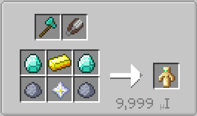

# EnderIO Slice'n'Splice

## Adding Recipes
Just like other recipe types, the Soul Binder also uses a recipe builder. <br>
You don't know what a builder is? Check [this](https://groovyscript-docs.readthedocs.io/en/latest/groovy/builder/) out
```groovy
mods.enderio.SliceNSplce.recipeBuilder()
```

Adding inputs: (requires 1 - 6) <br>
Here the order of inputs is important. The slot order is from left to right and top to bottom. 
All Slice'n'Splice recipres are "shaped". Meaning all inputs must go in their specified slot.
```groovy
.input(IIngredient)
.input(IIngredient...)
.input(Collection<IIngredient>)
```

Adding output: (requires exactly 1)
```groovy
.output(ItemStack)
```

Set xp chance: (optional (default is 0))    <br>// needs to be tested and confirmed 
````groovy
.xp(float) // 0.0 = 0% / 1.0 = 100%
````

Set required total energy: (optional (default is 5000))
```groovy
.energy(int)
```

Register recipe: (returns a `crazypants.enderio.base.recipe.Recipe` instance if successful)
````groovy
.register()
````

### Example
Here the inputs are split into two `input()` calls. This helps to visualize the recipe. 
````groovy
mods.enderio.SliceNSplice.recipeBuilder()
        .input('<minecraft:diamond>', '<minecraft:gold_ingot>', '<minecraft:diamond>')
        .input('<minecraft:clay_ball>', '<minecraft:nether_star>', '<minecraft:clay_ball>')
        .output('<minecraft:totem_of_undying>')
        .energy(9999)
        .register()
````
The example results in the following recipe:



## Removing Recipes
This removes a recipe that match the given input:
````groovy
mods.enderio.SliceNSplice.remove(ItemStack output)
````

### Example
````groovy
// removes slice n splice for tormented enderman head
mods.enderio.SliceNSplice.remove('<enderio:block_enderman_skull:2>')
````